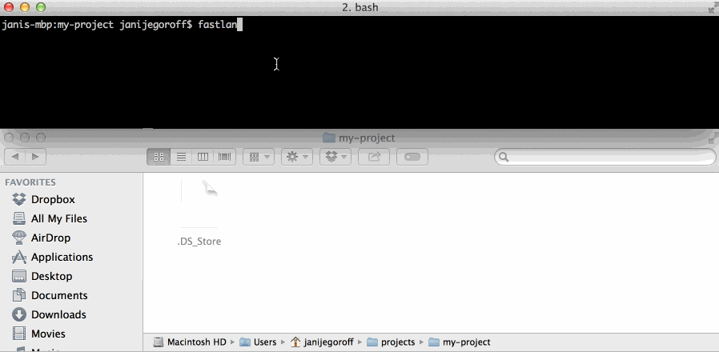

fastlane-yaml-init
==========

Provides fast init for [fastlane](https://github.com/KrauseFx/fastlane) creating basic folder structure, empty configuration files and metadata configuration in YAML format.

Installation
==========

`$ gem install fastlane-yaml-init`

Run the tests
==========

`$ bundle`

`$ gem build fastlane-yaml-init.gemspec`

`$ gem install fastlane-yaml-init-x.x.x.gem`

`$ rake`

License
==========

MIT
